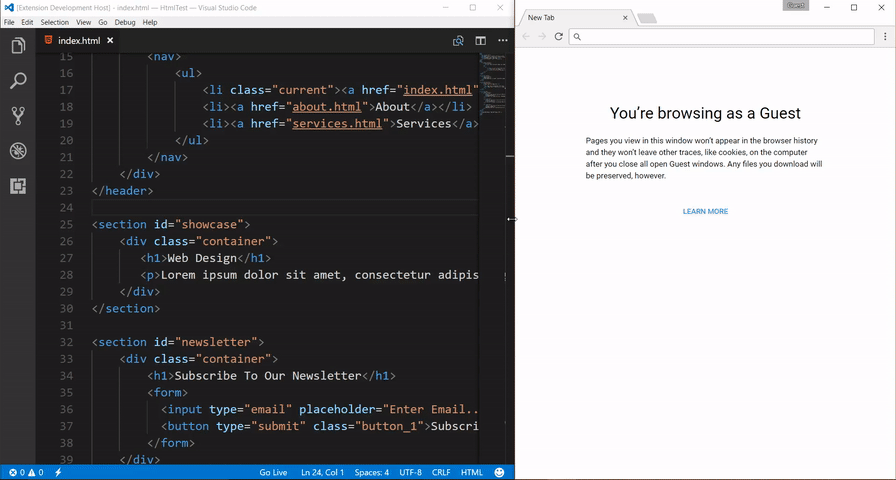

# บทที่ 7: การสร้างเว็บเพจเชิงตอบสนองและการประมวลผลผ่าน DOM และ BOM

บทนำในการพัฒนาเว็บแอปพลิเคชันฝั่งผู้ใช้งาน (Client-Side Web Development) ภาษา JavaScript ไม่ได้ทำหน้าที่เพียงแค่ประมวลผลตรรกะหรือเก็บข้อมูลในตัวแปรเท่านั้น แต่หัวใจสำคัญคือการเข้าไปควบคุม โต้ตอบ และเปลี่ยนแปลงส่วนประกอบต่างๆ บนหน้าเว็บเพจแบบเรียลไทม์ บทนี้จะนำพานักพัฒนาเปลี่ยนผ่านจากระบบหลังบ้านอย่าง Node.js เข้าสู่การรันจาวาสคริปต์บนเว็บเบราว์เซอร์อย่างเต็มรูปแบบ ผ่านการศึกษาเครื่องมือทรงประสิทธิภาพ 2 ตัวหลัก คือ Document Object Model (DOM) ซึ่งทำหน้าที่เป็นตัวแทนโครงสร้างวัตถุของเอกสาร HTML และ Browser Object Model (BOM) ซึ่งทำหน้าที่ควบคุมคุณลักษณะภายนอกและหน้าต่างของโปรแกรมเบราว์เซอร์ การเข้าใจกระบวนการทำงานเหล่านี้เป็นกุญแจสำคัญในการเนรมิตเว็บเพจธรรมดาให้กลายเป็นแอปพลิเคชันที่ตอบสนองอย่างชาญฉลาด

---

## จุดประสงค์การเรียนรู้
เมื่อศึกษาบทเรียนนี้จบแล้ว ผู้เรียนควรมีความสามารถดังนี้:
*   สามารถติดตั้งสภาพแวดล้อมและทดสอบโค้ดบนเบราว์เซอร์ผ่านระบบ Live Server บน VS Code ได้อย่างถูกต้อง
*   เข้าใจสถาปัตยกรรมและโครงสร้างลำดับชั้นของ Document Object Model (DOM)
*   ใช้งานตัวเลือกสืบค้น (DOM Selectors) ทั้งรูปแบบระบุพิกัดตรงตัวและรูปแบบประยุกต์ใช้ลวดลาย CSS ได้อย่างชำนาญ
*   สามารถปรับเปลี่ยนเนื้อหา (Content), แอตทริบิวต์ (Attributes), และรูปแบบสไตล์ (CSS Styles & Classes) ของอิลิเมนต์ HTML แบบไดนามิก
*   มีทักษะการเพิ่ม ลบ แทรก และแทนที่อิลิเมนต์บนหน้าเว็บผ่านคำสั่งควบคุม Dynamic DOM Nodes
*   เข้าใจหลักการและสามารถเรียกใช้ Browser Object Model (BOM) ในการจัดการหน้าต่าง ประวัติการท่องเว็บ และพิกัดตำแหน่ง URL

---

## ความสัมพันธ์ระหว่างผู้ใช้, เบราว์เซอร์, DOM และ BOM

อินโฟกราฟิกด้านล่างแสดงโครงสร้างการเชื่อมโยงการทำงานเมื่อ JavaScript รันบนเว็บเบราว์เซอร์ โดยมี BOM ทำหน้าที่ควบคุมตัวแอปพลิเคชันเบราว์เซอร์ทั้งหมด และมี DOM (ภายใต้ออบเจกต์ `document`) ทำหน้าที่ควบคุมโครงสร้างเนื้อหาของเว็บเพจภายในหน้าต่างนั้น:


---

## 1. การเตรียมสภาพแวดล้อมการเขียนสคริปต์บนเว็บเพจ

เบราว์เซอร์สมัยใหม่ทำงานในลักษณะผู้ตีความคำสั่ง (Interpreter) โดยจะประมวลผลไฟล์ HTML และแปลคำสั่งในแท็ก `<script>` ออกแสดงผลหน้าจอ การพัฒนาในยุคนี้สามารถจำลองเซิร์ฟเวอร์ท้องถิ่นขึ้นมาด้วย **Live Server** บน Visual Studio Code เพื่อเพิ่มความเร็วในการทดสอบระบบ

### การติดตั้งและใช้งาน Live Server บน VS Code
> [!IMPORTANT]
> **ขั้นตอนการติดตั้ง Live Server สำหรับผู้เรียน:**
> 
> 1. เปิดโปรแกรม **VS Code** แล้วคลิกที่ไอคอน **Extensions** (หรือกดปุ่ม `Ctrl+Shift+X` บน Windows)
> 2. ในช่องค้นหา ให้พิมพ์คำว่า `Live Server` (พัฒนาโดย *Ritwick Dey*) แล้วกดปุ่ม **Install**
> 3. เมื่อติดตั้งเสร็จ ให้คลิกเปิดโฟลเดอร์งานของคุณใน VS Code
> 4. สร้างไฟล์ HTML (เช่น `index.html`) จากนั้นคลิกขวาที่ไฟล์แล้วเลือก **Open with Live Server** (หรือคลิกปุ่ม **Go Live** ที่มุมขวาล่างของหน้าต่างโปรแกรม)
> 5. เบราว์เซอร์จะเปิดหน้าเว็บจำลองผ่านที่อยู่ `http://127.0.5.1:5500/` ขึ้นมาให้โดยอัตโนมัติ และจะทำการรีเฟรชหน้าเว็บให้ทันทีเมื่อคุณทำการแก้ไขและบันทึกโค้ด


> **ภาพเคลื่อนไหวสาธิตผลลัพธ์การทำงานของ Live Server (Live Reload):**
> 
> 

### หลักการสำคัญในการประกาศใช้แท็ก `<script>`
*   **การจัดกลุ่มความรู้ข้ามบล็อก (Global Shared Scope):** ตัวแปรหรือฟังก์ชันที่สร้างขึ้นในแท็ก `<script>` ตัวแรก (เช่น ในส่วน `<head>`) จะสามารถถูกนำมาเรียกใช้และคำนวณร่วมกับคำสั่งในแท็ก `<script>` ตัวถัดๆ ไป (เช่น ในส่วน `<body>`) ได้อย่างไร้รอยต่อ
*   **สคริปต์ภายนอก (External JavaScript):** การประกาศใช้แอตทริบิวต์ `src` ในแท็ก `<script>` เพื่อโหลดไฟล์สกุล `.js` ที่แยกสัดส่วนการเขียนตรรกะต่างหาก ช่วยให้โค้ดสะอาดตาและง่ายต่อการใช้ร่วมกันหลายๆ หน้าเพจ

### ตารางเปรียบเทียบลักษณะการจัดวางจาวาสคริปต์บนเว็บเพจ

| ลักษณะการจัดวาง | รูปแบบไวยากรณ์ | จุดประสงค์และข้อดี |
| :--- | :--- | :--- |
| **Inline (ในบรรทัด)** | `<button onclick="alert('OK')">` | ใช้ตอบสนองเหตุการณ์กระชับ รวดเร็วบนอิลิเมนต์เฉพาะตัว |
| **Internal (ภายในหน้า)** | `<script> let x = 10; </script>` | เขียนเพื่อควบคุมโครงสร้างทั้งหมดของหน้าเว็บนั้นหน้าเดียว |
| **External (ไฟล์ภายนอก)** | `<script src="assets/app.js"></script>` | แยกไฟล์โค้ด มีระบบ Cache โหลดเร็ว ใช้ร่วมกันได้หลายเว็บเพจ |

> [!TIP]
> **คำแนะนำสำหรับการรันตัวอย่างในส่วนนี้:** เนื่องจากโค้ดต่อไปนี้เป็นโครงสร้างเว็บเพจ HTML สมบูรณ์ จึงไม่มีปุ่ม *Try It* ให้รันบนระบบเว็บนี้ แนะนำให้ผู้เรียนสร้างไฟล์ HTML ใน **VS Code** และทดสอบรันด้วย **Live Server** เพื่อดูการทำงานจริง

### ตัวอย่างประกอบ: การแชร์ค่าตัวแปรข้ามบล็อกสคริปต์ใน HTML
```html
<!DOCTYPE html>
<html lang="th">
<head>
    <meta charset="UTF-8">
    <title>แชร์ขอบเขตตัวแปร Global</title>
    <!-- บล็อกที่ 1: ประกาศกำหนดค่าตั้งต้น -->
    <script>
        const TAX_RATE = 0.07;
        let productPrice = 2500;
    </script>
</head>
<body>
    <h3>ประมวลผลภาษีมูลค่าเพิ่ม</h3>
    <!-- บล็อกที่ 2: นำค่าที่ประกาศไว้ด้านบนมาคำนวณและแสดงผลออกหน้าจอ -->
    <script>
        let vatAmount = productPrice * TAX_RATE;
        let finalPrice = productPrice + vatAmount;

        document.write("ราคาสินค้าเริ่มต้น: " + productPrice + " บาท<br>");
        document.write("ภาษีมูลค่าเพิ่ม (7%): " + vatAmount + " บาท<br>");
        document.write("<strong>ราคาสุทธิที่ต้องชำระ: " + finalPrice + " บาท</strong>");
    </script>
</body>
</html>
```

---

## 2. การรับส่งข้อมูลและการรับมือกับผู้ใช้งาน (Output & Dialog Boxes)

JavaScript บนเบราว์เซอร์เตรียมกลไกการติดต่อกับผู้ใช้แบบเรียลไทม์ไว้ โดยมีความสามารถในการรับส่งข้อมูลผ่านกล่องไดอะล็อก และการพิมพ์ข้อความโครงสร้างเอกสารลงบนหน้าเว็บโดยตรงผ่านคำสั่ง `document.write()`

### แผนผังผลลัพธ์การทำงานของ Dialog Boxes ทั้ง 3 รูปแบบ


### ตารางเปรียบเทียบไดอะล็อกสื่อสารกับผู้ใช้งาน

| คำสั่งระบบ | พารามิเตอร์ที่รองรับ | ชนิดข้อมูลส่งกลับ (Return Value) | สถานการณ์ใช้งานที่เหมาะสม |
| :--- | :--- | :--- | :--- |
| **`alert(msg)`** | สตริงแจ้งเตือน | ไม่มีค่าคืนกลับ (`undefined`) | การแจ้งเหตุเตือนข้อผิดพลาดหรือยืนยันความสำเร็จ |
| **`prompt(q, default)`** | คำถาม, ค่าเริ่มต้นในช่องกรอก | สตริงข้อมูลที่พิมพ์เข้ามา (หรือได้ `null` หากกดยกเลิก) | การรับอินพุตเบื้องต้นจากผู้ใช้โดยไม่ต้องสร้างฟอร์ม |
| **`confirm(msg)`** | คำถามยืนยันการตัดสินใจ | ค่าบูลีน (`true` หรือ `false`) | การสอบถามสิทธิ์ความสมัครใจ เช่น ก่อนลบข้อมูล |

> [!TIP]
> **คำแนะนำสำหรับผู้เรียน:** เนื่องจากคำสั่งโต้ตอบทางหน้าต่างเบราว์เซอร์ (Dialog Boxes) ต้องการเบราว์เซอร์จริงในการเรนเดอร์กล่องป๊อปอัป โค้ดด้านล่างนี้จึงเหมาะสำหรับคัดลอกไปรันบนไฟล์สคริปต์ที่เชื่อมต่อกับไฟล์ HTML ในเครื่องและเปิดผ่าน Live Server

### ตัวอย่างประกอบ: การคำนวณและตอบสนองผ่านไดอะล็อก
```javascript
// สอบถามเพื่อเพิ่มระดับความมั่นใจของผู้ใช้
let allowProcess = confirm("คุณต้องการเริ่มต้นคำนวณภาษีสะสมประจำปีใช่หรือไม่?");

if (allowProcess) {
    let incomeInput = prompt("กรุณากรอกยอดเงินได้สุทธิของคุณ (บาท):", "300000");
    
    // ตรวจสอบกรณีที่กดยกเลิก หรือไม่ระบุข้อมูล
    if (incomeInput !== null && incomeInput.trim() !== "") {
        let income = parseFloat(incomeInput);
        let tax = income * 0.05; // สมมติอัตราภาษี 5%
        
        alert("คำนวณเรียบร้อย!\nคุณมียอดภาษีสะสมที่ต้องชำระ: " + tax + " บาท");
    } else {
        alert("คุณไม่ได้กรอกตัวเลข หรือกดยกเลิกการทำงาน");
    }
} else {
    console.log("ผู้ใช้ปฏิเสธการประมวลผลระบบ");
}
```

---

## 3. โครงสร้างและการสืบค้น DOM (DOM Selectors)

เบราว์เซอร์จะแปลงเนื้อหาของหน้าเว็บ HTML ให้กลายเป็นวัตถุโครงสร้างต้นไม้ที่เรียกว่า DOM ซึ่งสามารถเข้าถึงตัววัตถุเหล่านั้นได้ผ่านคลาสระบบ `document` ด้วยชุดฟังก์ชันสืบค้น (Selectors)

### ตารางสรุปการใช้งาน DOM Selectors ยอดนิยม

| คำสั่งเรียกใช้ | ขอบเขตการค้นหา | ลักษณะค่าคืนกลับ | ข้อสังเกตเชิงลึก |
| :--- | :--- | :--- | :--- |
| **`getElementById(id)`** | ไอดีระบุเฉพาะตัว | ออบเจกต์ชิ้นเดียว | มีประสิทธิภาพความเร็วสูงสุด ค้นตามตัวพิมพ์เล็ก-ใหญ่ตรงกัน |
| **`getElementsByName(name)`** | ค้นจากแอตทริบิวต์ name | อาเรย์ออบเจกต์ (`NodeList`) | มักใช้คู่กับฟอร์มและกลุ่มปุ่มตัวเลือก (`radio`, `checkbox`) |
| **`getElementsByTagName(tag)`** | ค้นจากชื่อแท็ก HTML | อาเรย์ออบเจกต์ (`HTMLCollection`) | สะดวกเมื่อต้องการเปลี่ยนค่าทั้งประเภท เช่น ลิสต์ `<li>` ทั้งหมด |
| **`getElementsByClassName(cls)`** | ค้นจากคลาสของ CSS | อาเรย์ออบเจกต์ (`HTMLCollection`) | สามารถระบุกลุ่มอิลิเมนต์ที่มีการตั้งคลาสซ้ำกันได้ |
| **`querySelector(sel)`** | ระบุไวยากรณ์แบบ CSS Selector | ออบเจกต์ชิ้นแรกตัวเดียว | มีความยืดหยุ่นสูง ค้นหาเชิงลึก ซ้อนระดับได้ง่าย |
| **`querySelectorAll(sel)`** | ระบุไวยากรณ์แบบ CSS Selector | อาเรย์ออบเจกต์ (`NodeList`) | ดึงรายการที่ตรงทั้งหมดออกมา สามารถเข้าถึงผ่านลูปได้อย่างดี |

### ไวยากรณ์ลวดลายของ CSS Selector สำหรับ `querySelector`
*   **ตัวเลือกคลาสและไอดี:** `.box-warning` (ค้นหาคลาส), `#title` (ค้นหาไอดี)
*   **ตัวเลือกแอตทริบิวต์:** `input[type="checkbox"]`, `input[name="color"][readonly]`
*   **ตัวเลือกลำดับโครงสร้าง (Structural Pseudo-classes):** `div > span` (สแปนที่เป็นลูกตรงของดิฟ), `span:first-child` (ลูกคนแรกสุดที่เป็นสแปน), `span:nth-child(2)` (ลูกพิกัดตำแหน่งที่ 2)

> [!TIP]
> **คำแนะนำสำหรับผู้เรียน:** ตัวอย่างโค้ด HTML ด้านล่างนี้อ้างอิงและจัดการโครงสร้างของหน้าเว็บด้วย DOM Selector กรุณานำโค้ดนี้ไปรันผ่านระบบ **Live Server** ใน VS Code เพื่อดูการบันทึกข้อความลงบนหน้าต่าง Web Developer Console ของเบราว์เซอร์จริง

### ตัวอย่างประกอบ: การสืบค้นพิกัดเดี่ยวและกลุ่มด้วย DOM Selectors
```html
<!DOCTYPE html>
<html>
<head>
    <meta charset="UTF-8">
    <title>สาธิตสิทธิ์การสืบค้น DOM Selectors</title>
</head>
<body>
    <h1 id="title">หน้าหลักควบคุมร้านค้า</h1>
    <ul class="product-list">
        <li class="item">เสื้อยืดลำลอง</li>
        <li class="item">กางเกงขายาวกีฬา</li>
        <li class="item">รองเท้าวิ่งฟิตเนส</li>
    </ul>

    <script>
        // 1. สืบค้นพิกัดเดี่ยวผ่าน id
        let mainHeader = document.getElementById("title");
        console.log("หัวข้อเดิม:", mainHeader.innerHTML);

        // 2. สืบค้นพิกัดยืดหยุ่นด้วย CSS Selector ดึงรายการทั้งหมด
        let listItems = document.querySelectorAll(".product-list > .item");
        
        // วนลูปเพื่ออ่านข้อความของผลลัพธ์ทั้งหมด
        for (let product of listItems) {
            console.log("ชื่อสินค้าในลิสต์:", product.innerText);
        }
    </script>
</body>
</html>
```

---

## 4. การจัดการเนื้อหาและแอตทริบิวต์ (Content & Attribute Manipulations)

เมื่อเข้าถึงอิลิเมนต์เป้าหมายได้แล้ว เราสามารถเลือกเปลี่ยนข้อความภายในของมัน หรือควบคุมแอตทริบิวต์ต่างๆ ของตัวแท็ก เช่น เปลี่ยนพิกัดภาพสัญลักษณ์ เปลี่ยนสถานะการปิดปุ่มทำงาน เป็นต้น

### ตารางสรุปการทำงานของ `innerHTML`, `innerText` และ `value`

| พร็อพเพอร์ตี้ | รูปแบบการเข้าทำงาน | ผลลัพธ์เชิงเทคนิค |
| :--- | :--- | :--- |
| **`innerHTML`** | อ่าน/เขียน โครงสร้างเนื้อความ | แสดงผลข้อความควบคู่ไปกับ **การตีความแท็ก HTML** คล้ายเบราว์เซอร์จริง |
| **`innerText`** | อ่าน/เขียน เฉพาะตัวหนังสือดิบ | มองอักขระหรือแท็กที่ป้อนเข้าไปใหม่เป็นเพียงข้อความธรรมดา ไม่ประมวลผลแท็ก |
| **`value`** | ดึง/ตั้งค่า ข้อมูลของอินพุตฟอร์ม | ใช้สำหรับดึงค่าพิมพ์กรอกจาก `input`, `textarea` หรือค่าตัวเลือก `select` |

### ตารางฟังก์ชันการจัดการคุณสมบัติและแอตทริบิวต์ (Attributes)

| คำสั่งเมธอด | หน้าที่การทำงาน | ตัวอย่างการประยุกต์ใช้งานจริง |
| :--- | :--- | :--- |
| **`getAttribute(name)`** | อ่านค่าพารามิเตอร์ของแอตทริบิวต์ | `img.getAttribute('src')` (อ่านพาร์ทรูปปัจจุบัน) |
| **`setAttribute(name, val)`** | กำหนดค่าแอตทริบิวต์ใหม่ทดแทน | `btn.setAttribute('disabled', 'true')` (สั่งบล็อกปุ่ม) |
| **`removeAttribute(name)`** | ลบโครงสร้างแอตทริบิวต์ออกไปจากแท็ก | `input.removeAttribute('readonly')` (เปิดให้อินพุตเขียนได้) |

> [!TIP]
> **คำแนะนำสำหรับผู้เรียน:** ตัวอย่างด้านล่างจำลองการกดปุ่มเพื่อปลดล็อกแอตทริบิวต์ `readonly` และแก้ไขเนื้อความแบบไดนามิก กรุณานำไปทดสอบรันด้วย **Live Server** ใน VS Code

### ตัวอย่างประกอบ: การเปลี่ยนค่าเนื้อหาและควบคุมแอตทริบิวต์
```html
<!DOCTYPE html>
<html>
<head>
    <meta charset="UTF-8">
    <title>จัดการแอตทริบิวต์</title>
</head>
<body>
    <div id="content-box"></div>
    <br>
    <input type="text" id="username" value="guest_account" readonly>
    <button type="button" id="btn-edit" onclick="enableInput()">อนุญาตให้ทำการแก้ไข</button>

    <script>
        let contentDiv = document.getElementById("content-box");
        let userInput = document.getElementById("username");

        // 1. เปรียบเทียบ innerHTML และ innerText
        contentDiv.innerHTML = "<span style='color:green; font-weight:bold;'>โครงสร้างภายในแบบไดนามิกที่ผ่านการทดสอบแล้ว</span>";
        
        // 2. ปลดล็อกช่องอินพุตโดยการจัดการแอตทริบิวต์
        function enableInput() {
            userInput.removeAttribute("readonly");
            userInput.setAttribute("style", "border: 2px solid blue; padding: 4px;");
            userInput.value = "กรอกชื่อใหม่ที่นี่...";
            
            let btn = document.getElementById("btn-edit");
            btn.innerText = "ปลดล็อกเรียบร้อย";
            btn.setAttribute("disabled", "true"); // ปิดปุ่มเพื่อป้องกันการกดย้ำ
        }
    </script>
</body>
</html>
```

---

## 5. การควบคุมรูปแบบ CSS และจัดการคลาสสไตล์ (CSS Styles & Classes)

JavaScript สามารถเปลี่ยนรูปลักษณ์ความสวยงามของเว็บเพจได้ 2 รูปแบบหลัก คือ การตั้งค่าสไตล์แบบสอดแทรกตรงจุด (Inline Styles) ผ่านพร็อพเพอร์ตี้ `.style` และการเปลี่ยนชื่อคลาสสไตล์ CSS ผ่าน `.className` หรือออบเจกต์ความช่วยจัดระเบียบอย่าง `.classList`

### การแปลงชื่อสไตล์ CSS จากเคบับ (Kebab-case) ไปเป็นคาเมล (CamelCase)
ในระบบสไตล์ของ CSS ปกติจะคั่นคำด้วยเครื่องหมายขีดล่างสั้น (`-`) แต่เมื่อถูกเรียกใช้งานบน JavaScript ระบบจะห้ามใช้สัญลักษณ์ขีดคั่น (เนื่องจากจะถูกมองเป็นการหักเลขคณิต) จึงปรับไปใช้การเขียนแบบตัวพิมพ์ใหญ่นำสายคำ (CamelCase) แทน ดังตัวอย่างนี้:

```
  สไตล์ใน CSS:         background-color        font-size        border-left-style
                            │                      │                     │
                            ▼                      ▼                     ▼
  เรียกใช้ใน JS:      .style.backgroundColor    .style.fontSize   .style.borderLeftStyle
```

### ตารางเครื่องมือจัดการคลาสสไตล์ของวัตถุอิลิเมนต์

| เครื่องมือคุณสมบัติ | หน้าที่การทำงาน | ตัวอย่างการทำงานจริง |
| :--- | :--- | :--- |
| **`.className`** | จัดการกลุ่มคลาสทั้งหมดในรูปสตริงคำยาว | `el.className = 'btn warning active';` |
| **`.classList.add(cls)`** | เพิ่มรายชื่อคลาสใหม่แทรกลงไป | `el.classList.add('new-animation');` |
| **`.classList.remove(cls)`** | ลบรายชื่อคลาสเฉพาะตัวที่ระบุออก | `el.classList.remove('temp-hidden');` |
| **`.classList.toggle(cls)`** | ตรวจสอบเพื่อเปิด/ปิดสลับสถานะคลาส | `el.classList.toggle('dark-mode');` |
| **`.classList.contains(cls)`** | เช็คว่าอิลิเมนต์ถูกครอบด้วยคลาสนี้อยู่ไหม | `if (el.classList.contains('active')) { ... }` |

> [!TIP]
> **คำแนะนำสำหรับผู้เรียน:** ตัวอย่างโค้ดต่อไปนี้ช่วยสาธิตการใช้ `classList.toggle` ในการสลับคลาส CSS สไตล์เป็นโหมดเตือนภัย รวมถึงการดึงค่าสไตล์จริงที่ถูกเรนเดอร์ออกมา แนะนำรันด้วย Live Server

### ตัวอย่างประกอบ: การสลับคลาส CSS และตั้งค่า Inline Style แบบคาเมลเคส
```html
<!DOCTYPE html>
<html>
<head>
    <meta charset="UTF-8">
    <title>สลับโหมด CSS Style</title>
    <style>
        .box { width: 300px; padding: 20px; text-align: center; border: 1px solid #ccc; transition: all 0.3s; }
        .danger-alert { background-color: #ffdddd; color: #ff0000; font-weight: bold; }
    </style>
</head>
<body>
    <div id="info-card" class="box">นี่คือกล่องข้อความเตือนภัย</div>
    <br>
    <button type="button" onclick="triggerAlert()">แสดงผลโหมดอันตราย</button>

    <script>
        function triggerAlert() {
            let card = document.getElementById("info-card");
            
            // ใช้ classList สลับระดับกลุ่ม CSS
            card.classList.toggle("danger-alert");
            
            // หรือการปรับตั้งค่าแบบไดนามิกเฉพาะจุด (Inline style)
            card.style.fontSize = "22px";
            card.style.borderLeftStyle = "solid";
            card.style.borderLeftWidth = "10px";
            card.style.borderLeftColor = "darkred";

            // การสืบค้นดึงค่าที่เบราว์เซอร์นำมาคำนวณสไตล์จริงในขณะนั้น
            let finalColor = getComputedStyle(card).color;
            console.log("สีที่เบราว์เซอร์เรนเดอร์ในขณะนี้:", finalColor);
        }
    </script>
</body>
</html>
```

---

## 6. การสร้างและปรับผังตำแหน่งอิลิเมนต์แบบไดนามิก (Dynamic DOM Node Operations)

JavaScript สามารถสร้างอิลิเมนต์หรือส่วนประกอบใหม่ของหน้าเว็บขึ้นมากลางคัน และนำมันไปบรรจุ เสียบแทรก หรือลบออกจากโครงสร้างความสัมพันธ์ต้นไม้ (DOM Tree) ได้อย่างอิสระ

### แผนภาพแสดงกระบวนการสร้างและติดตั้ง Element ใหม่ลงบน DOM Tree

```
  [1] สร้าง Element ใหม่ด้วยคลาสระบบ
      let newLink = document.createElement("a");
                      │
                      ▼
  [2] เพิ่มแอตทริบิวต์และข้อความเนื้อใน
      newLink.setAttribute("href", "https://google.com");
      newLink.innerHTML = "ค้นหาผ่านกูเกิล";
                      │
                      ▼
  [3] ค้นหาอิลิเมนต์เป้าหมายที่เป็นพ่อผู้รองรับ
      let container = document.getElementById("link-panel");
                      │
                      ▼
  [4] ติดตั้งและยึดโครงสร้างเชื่อมโยงเข้าด้วยกัน
      container.appendChild(newLink);
```

### ตารางสรุปคำสั่งสร้างและจัดตำแหน่ง Nodes

| คำสั่งควบคุมหลัก | หน้าที่เชิงลึก | ตัวอย่างการเขียนประยุกต์ใช้ |
| :--- | :--- | :--- |
| **`createElement(tag)`** | สร้างออบเจกต์อิลิเมนต์ชนิดใหม่ขึ้นในหน่วยความจำ | `let newDiv = document.createElement('div')` |
| **`appendChild(childNode)`** | นำไปต่อท้ายเป็นลูกลำดับสุดท้ายภายใต้อิลิเมนต์เป้าหมาย | `parent.appendChild(newDiv)` |
| **`insertBefore(new, ref)`** | แทรกอิลิเมนต์ใหม่ไว้ทางด้านหน้าของอิลิเมนต์อ้างอิง `ref` | `parent.insertBefore(newDiv, oldItem)` |
| **`replaceChild(new, old)`** | ถอดถอนอิลิเมนต์เก่า `old` แล้วแทนที่ด้วยอันใหม่ `new` | `parent.replaceChild(newDiv, oldItem)` |
| **`removeChild(childNode)`** | ปลดชิ้นส่วนอิลิเมนต์ลูกออกไปจากโครงสร้างเอกสาร | `parent.removeChild(oldItem)` |

> [!TIP]
> **คำแนะนำสำหรับผู้เรียน:** ตัวอย่างโค้ดนี้สาธิตการแทรกคิวงานสีแดง (งานเร่งด่วน) ก่อนงานอื่นๆ และลบรายการประชุมออกไปทันทีด้วยคำสั่ง Node ควบคุมแบบเรียลไทม์ กรุณาคัดลอกไปทดลองใช้งานบนเซิร์ฟเวอร์จำลอง Live Server

### ตัวอย่างประกอบ: การประกอบ จัดตำแหน่ง และลบ Nodes
```html
<!DOCTYPE html>
<html>
<head>
    <meta charset="UTF-8">
    <title>จัดการคิวงานด้วย Dynamic DOM</title>
</head>
<body>
    <ul id="job-queue">
        <li id="task-2">ดำเนินการตรวจสอบระบบขนส่ง</li>
        <li id="task-3">ประชุมสรุปยอดจำหน่ายสินค้า</li>
    </ul>
    <br>
    <button onclick="manageQueue()">แทรกคิวงานเร่งด่วน</button>

    <script>
        function manageQueue() {
            let queueList = document.getElementById("job-queue");
            
            // 1. ดำเนินการสร้าง Task ใหม่ขึ้นมาทำงาน
            let newTask = document.createElement("li");
            newTask.setAttribute("id", "task-1");
            newTask.style.color = "red";
            newTask.style.fontWeight = "bold";
            newTask.innerText = "งานเร่งด่วนที่สุด: ตรวจสอบเซิร์ฟเวอร์หลักล่ม!";

            // 2. ทำการสืบค้นหาตัวชิ้นอ้างอิง เพื่อนำมาแทรกไว้ด้านหน้า
            let refTask = document.getElementById("task-2");
            queueList.insertBefore(newTask, refTask);

            // 3. ตัวอย่างการถอดรายการออกจากการทำงาน
            let completedTask = document.getElementById("task-3");
            if (completedTask) {
                queueList.removeChild(completedTask);
            }
        }
    </script>
</body>
</html>
```

---

## 7. การควบคุมและดึงข้อมูลสภาพแวดล้อมหน้าเว็บเบราว์เซอร์ (BOM)

นอกจากโครงสร้างของหน้าเอกสาร HTML แล้ว JavaScript ยังสามารถดึงหรือตั้งค่าภายนอกของโปรแกรมผู้ท่องเว็บได้โดยตรงผ่านออบเจกต์แม่ `window` ซึ่งควบคุมส่วนย่อยที่น่าสนใจ เช่น ประวัติความหลังการเปลี่ยนหน้า (`history`), ท้องถิ่นข้อมูลยูอาร์แอลพิกัด (`location`), และข้อมูลของโปรแกรมเบราว์เซอร์เพื่อพิจารณาความพร้อมของระบบ (`navigator`)

### ตารางคุณลักษณะและเมธอดเด่นของ Browser Object Model (BOM)

| กลุ่มออบเจกต์ | คำสั่ง / เมธอดเด่น | หน้าที่ที่ทำงาน | ตัวอย่างสถานการณ์ประยุกต์ใช้ |
| :--- | :--- | :--- | :--- |
| **`history`** | `history.back()` <br> `history.forward()` <br> `history.go(offset)` | สั่งย้อนหลัง 1 หน้า <br> สั่งเดินหน้า 1 หน้า <br> ข้ามหน้าตามระยะ (ติดลบคือย้อน) | สร้างปุ่มย้อนกลับภายในเพจ <br> ควบคุมการกรอกฟอร์มแบบทีละขั้นตอน <br> `history.go(-2)` (ย้อนกลับสองหน้า) |
| **`location`** | `location.href` <br> `location.reload()` | อ่านหรือเปลี่ยนลิงก์ไปยัง URL ใหม่ <br> รีโหลดหรือปรับหน้าข้อมูลใหม่ | `location.href = 'url'` (เปลี่ยนหน้าเว็บ) <br> บังคับรีเฟรชค่าข้อมูลบนเว็บ |
| **`window`** | `window.open(url)` <br> `window.close()` | เปิดแท็บ/หน้าต่างเบราว์เซอร์ใหม่ <br> สั่งปิดหน้าต่างที่สคริปต์เปิดขึ้น | เปิดใบเสร็จรับเงินในแท็บใหม่ <br> ปิดแท็บป๊อปอัปหลังทำธุรกรรมเสร็จ |
| **`navigator`** | `navigator.userAgent` | ดึงข้อมูลยี่ห้อและรุ่นของเบราว์เซอร์ | ตรวจสอบประเภทเบราว์เซอร์เพื่อแก้ไขบั๊กสไตล์ |

> [!TIP]
> **คำแนะนำสำหรับผู้เรียน:** ออบเจกต์ `navigator` จะดึงข้อมูลแอปพลิเคชันเบราว์เซอร์ปัจจุบันมาวิเคราะห์หาประเภทและรุ่นผู้ใช้งาน เมื่อทดสอบรันด้วย Live Server โค้ดนี้จะแจ้งเตือนประเภทเบราว์เซอร์ของคุณออกมาทางป๊อปอัป

### ตัวอย่างประกอบ: การตรวจสอบรุ่นและยี่ห้อเบราว์เซอร์ของผู้ใช้ผ่าน BOM
```javascript
function detectBrowser() {
    let agent = navigator.userAgent;
    console.log("User Agent ของคุณคือ:", agent);

    if (agent.search("Edge") >= 0) {
        return "Microsoft Edge";
    } else if (agent.search("Firefox") >= 0) {
        return "Mozilla Firefox";
    } else if (agent.search("OPR") >= 0) {
        return "Opera Browser";
    } else if (agent.search("Chrome") >= 0) {
        return "Google Chrome";
    } else if (agent.search("Safari") >= 0) {
        return "Apple Safari";
    } else {
        return "ไม่สามารถระบุยี่ห้อเบราว์เซอร์จากฐานข้อมูลต้นฉบับได้";
    }
}

alert("คุณเข้าสู่ระบบนี้โดยการประยุกต์ใช้งานเบราว์เซอร์: " + detectBrowser());
```

---

## สรุปบทเรียน
การสร้างสรรค์หน้าเว็บเพจที่มีความยืดหยุ่นและการทำงานแบบไดนามิกเกิดจากการประสานเครื่องมือสำคัญดังนี้:
*   **JavaScript Integration:** นำโค้ดมาปรับพฤติกรรมบนโครงสร้างของสคริปต์แชร์ค่าข้ามบล็อกสคริปต์เพื่อประมวลผลร่วมกัน
*   **Dialogs:** ควบคุมการนำเข้าข้อมูลและการรายงานผลตอบรับแก่ผู้เรียนด้วยชุดคำสั่ง `alert()`, `prompt()`, และ `confirm()`
*   **DOM Selectors:** ค้นหาวัตถุเป้าหมายตามหลัก ID, Class, Name, Tag หรือประยุกต์ใช้ CSS Selector เพื่อสับเปลี่ยนโครงสร้างและเนื้อหาด้วย `innerHTML`, `innerText` และ `value`
*   **CSS Styles & Classes:** ปรับแต่ง CSS แบบ Inline โดยใช้รูปแบบคำสัญกรณ์แบบคาเมลเคส (CamelCase) หรือการจัดการรายชื่อคลาสอย่างมีประสิทธิภาพด้วย `.classList`
*   **Dynamic Nodes:** ความสามารถในการสร้าง ลบ หรือสอดแทรกอิลิเมนต์ใหม่ๆ ลงบนตำแหน่งใดก็ได้ในเอกสาร HTML แบบเรียลไทม์
*   **BOM Objects:** ดึงและตั้งค่าสภาพแวดล้อมภายนอก เช่น การรีโหลดหรือเปลี่ยนหน้าด้วย `location`, การควบคุมประวัติด้วย `history` และการตรวจสอบยี่ห้อเบราว์เซอร์ด้วย `navigator.userAgent`

---

## ❓ คำถามทบทวน (Review Questions)

คลิกที่การ์ดคำถามด้านล่างเพื่อแสดงเฉลยคำตอบของคำถามแต่ละข้อ:

1. **การเขียนโค้ดจาวาสคริปต์แชร์ค่าข้ามแท็ก `<script>` (Shared Scope) มีข้อควรระวังในเรื่องความต่อเนื่องและลำดับขั้นตอนการโหลดหน้าเว็บอย่างไรบ้าง?**
   <details spellcheck="false" data-lt-active="false" data-gramm="false" data-gramm_editor="false">
     <summary>ดูเฉลยคำตอบ</summary>
     <div class="details-content">
       มีข้อควรระวังคือ **ลำดับการประมวลผลและการประกาศค่า (Execution Order)** เนื่องจากเบราว์เซอร์จะตีความสคริปต์จากบนลงล่าง หากแท็ก <code>&lt;script&gt;</code> บล็อกหลังดึงค่าตัวแปรหรือฟังก์ชันที่ถูกประกาศไว้ในบล็อกแรกมาทำงาน สคริปต์บล็อกแรกจะต้องถูกดาวน์โหลดและรันสำเร็จก่อน หากสลับตำแหน่งหรือบล็อกแรกเกิดข้อผิดพลาด บล็อกถัดไปจะไม่สามารถเรียกใช้ตัวแปรเหล่านั้นได้และจะส่งผลให้เกิดข้อผิดพลาดประเภท <code>ReferenceError</code> ทันที
     </div>
   </details>

2. **คำสั่ง `document.write()` เหมาะสำหรับกระบวนการพัฒนาหน้าเว็บประเภทใด และในขั้นตอนใดที่เราควรเปลี่ยนไปใช้การปรับค่าสไตล์ระดับ DOM แทนที่จะใช้คำสั่งนี้?**
   <details spellcheck="false" data-lt-active="false" data-gramm="false" data-gramm_editor="false">
     <summary>ดูเฉลยคำตอบ</summary>
     <div class="details-content">
       <code>document.write()</code> เหมาะสำหรับขั้นตอนการเรียนรู้เบื้องต้นและการทดสอบเขียนข้อความลงบนหน้าเว็บในช่วงเริ่มต้นเท่านั้น แต่มีข้อจำกัดอย่างร้ายแรงคือ หากมีการเรียกใช้คำสั่งนี้หลังจากที่เบราว์เซอร์เรนเดอร์เอกสาร HTML โหลดเสร็จสิ้นแล้ว (เช่น เรียกใช้ผ่านปุ่มคลิก) มันจะล้างเนื้อหาของหน้าเว็บเดิมทิ้งทั้งหมดและเขียนใหม่ทับทันที ดังนั้น ในขั้นตอนที่หน้าเว็บโหลดสมบูรณ์แล้ว หรือต้องการแก้ไขเนื้อหาบางจุด เราจึงต้องเปลี่ยนมาใช้การเข้าถึงและปรับแต่งสไตล์/ข้อมูลผ่านแอตทริบิวต์ระดับ DOM เช่น <code>innerHTML</code>, <code>innerText</code> หรือจัดการสไตล์ผ่านคุณสมบัติ <code>.style</code> แทน
     </div>
   </details>

3. **จงอธิบายพฤติกรรมและความแตกต่างในการคืนค่าข้อมูลกลับมา (Return Value) ของไดอะล็อก `prompt()` เมื่อผู้ใช้อิลิเมนต์ป้อนข้อมูลแล้วกดยืนยัน เปรียบเทียบกับตอนที่ผู้ใช้กดยกเลิก**
   <details spellcheck="false" data-lt-active="false" data-gramm="false" data-gramm_editor="false">
     <summary>ดูเฉลยคำตอบ</summary>
     <div class="details-content">
       - หากผู้ใช้กรอกข้อมูลแล้วกดยืนยัน (OK): ไดอะล็อก <code>prompt()</code> จะคืนค่ากลับมาเป็น **ข้อมูลข้อความสตริง (String)** เสมอ แม้ว่าผู้ใช้จะป้อนตัวเลขหรือไม่ได้ป้อนอะไรเลยก็ตาม (จะได้สตริงว่าง <code>""</code>)<br>
       - หากผู้ใช้กดปฏิเสธหรือยกเลิก (Cancel): ไดอะล็อกจะคืนค่าพิเศษที่มีประเภทเป็นวัตถุว่างเปล่าคือ **<code>null</code>**
     </div>
   </details>

4. **ถ้าเราพบอิลิเมนต์บนหน้าเว็บ 2 ตัวใช้คีย์ไอดีระบุซ้ำกัน คำสั่ง `document.getElementById()` จะได้ผลลัพธ์ในการทำงานอย่างไร? จงอธิบายเหตุผลประกอบเชิงเทคนิค**
   <details spellcheck="false" data-lt-active="false" data-gramm="false" data-gramm_editor="false">
     <summary>ดูเฉลยคำตอบ</summary>
     <div class="details-content">
       ในทางเทคนิคเบราว์เซอร์จะตรวจสอบและส่งกลับออบเจกต์ **อิลิเมนต์ตัวแรกสุดที่ตรวจพบในโครงสร้างเอกสาร (First Matching Element)** เพียงตัวเดียวเท่านั้น เนื่องจากตามมาตรฐานโครงสร้าง HTML ค่าไอดี (ID) จะต้องเป็นค่าเฉพาะที่ไม่ซ้ำกันในหน้าเดียวกัน หากเราทำซ้ำระบบจะไม่สืบค้นต่อหลังจากพบเป้าหมายแรกเพื่อจำกัดทรัพยากรการค้นหา
     </div>
   </details>

5. **เปรียบเทียบและวิเคราะห์ผลลัพธ์ความแตกต่างในการแสดงผลเมื่อนักพัฒนาพิมพ์ใส่โครงสร้างข้อความสตริงอย่าง `<b>Warning!</b>` เข้าไปใน `innerHTML` และ `innerText`**
   <details spellcheck="false" data-lt-active="false" data-gramm="false" data-gramm_editor="false">
     <summary>ดูเฉลยคำตอบ</summary>
     <div class="details-content">
       - หากระบุใส่ใน <code>innerHTML</code>: เบราว์เซอร์จะทำการตีความแท็ก <code>&lt;b&gt;</code> ทำให้ตัวอักษร <code>Warning!</code> แสดงผลออกมาเป็น **ตัวหนา** บนหน้าจอเว็บเพจ<br>
       - หากระบุใส่ใน <code>innerText</code>: ระบบจะไม่ตีความแท็ก และจะนำสายอักขระดังกล่าวไปแสดงผลเป็นข้อความดิบๆ ตรงตัวตามอักษร ทำให้อ่านได้เป็น <code>&lt;b&gt;Warning!&lt;/b&gt;</code> ทันที
     </div>
   </details>

6. **เพราะเหตุใดในการแปลงคำสั่งสไตล์จาก CSS ไปเขียนใช้งานใน JavaScript พร็อพเพอร์ตี้อย่าง `background-image` และ `padding-left` จึงจำเป็นต้องปรับแต่งให้อยู่ในรูปคาเมลเคส (CamelCase)?**
   <details spellcheck="false" data-lt-active="false" data-gramm="false" data-gramm_editor="false">
     <summary>ดูเฉลยคำตอบ</summary>
     <div class="details-content">
       เนื่องจากในภาษา JavaScript เครื่องหมายขีดกลาง (<code>-</code>) ถูกใช้เป็นตัวดำเนินการทางคณิตศาสตร์คือ "เครื่องหมายลบ" (Minus Sign) หากนำคำว่า <code>element.style.background-color</code> ไปใช้ ระบบจะตีความว่าเป็นการนำตัวแปร <code>background</code> มาลบกับตัวแปร <code>color</code> ซึ่งทำให้เกิดข้อผิดพลาดในการเขียนโปรแกรม ดังนั้นไวยากรณ์จึงต้องทำการแปลงตัวย่อจากเครื่องหมายขีดล่างสั้นเป็นอักษรพิมพ์ใหญ่แทนในลักษณะของ CamelCase เช่น <code>backgroundColor</code> และ <code>paddingLeft</code>
     </div>
   </details>

7. **หากต้องการเช็คสถานะว่ากล่องข้อความเป้าหมายถูกเปิดใช้งานคลาสสไตล์อันตรายอย่าง `.error` อยู่ในขณะนี้หรือไม่ ควรเลือกใช้งานเมธอดและชุดตรวจสอบใดของ `classList`?**
   <details spellcheck="false" data-lt-active="false" data-gramm="false" data-gramm_editor="false">
     <summary>ดูเฉลยคำตอบ</summary>
     <div class="details-content">
       ควรใช้เมธอด <code>element.classList.contains('error')</code> ซึ่งจะช่วยตรวจสอบโครงสร้างสไตล์คลาสและคืนค่าข้อมูลมาเป็นชนิดบูลีน (<code>true</code> หากมีคลาสนั้นอยู่ หรือ <code>false</code> หากไม่มี)
     </div>
   </details>

8. **เมื่อเราสั่งสร้างออบเจกต์ชิ้นใหม่ทางหน้าจอเว็บด้วย `document.createElement("p")` เพราะเหตุใดตัวอักษรนั้นจึงยังไม่ปรากฏให้ผู้ใช้เห็นบนจอภาพเว็บ และเราต้องนำคำสั่งใดมาสั่งยึดติดโยงจึงจะได้ผลลัพธ์บนจอภาพสมบูรณ์?**
   <details spellcheck="false" data-lt-active="false" data-gramm="false" data-gramm_editor="false">
     <summary>ดูเฉลยคำตอบ</summary>
     <div class="details-content">
       เนื่องจากคำสั่ง <code>createElement()</code> จะสร้างวัตถุอิลิเมนต์ขึ้นมาจัดเก็บไว้ในหน่วยความจำชั่วคราวเท่านั้น แต่ตัวอิลิเมนต์ดังกล่าวยังไม่มีความเชื่อมโยงกับสายโครงสร้างต้นไม้หน้าเอกสารจริง (DOM Tree) เราจำเป็นต้องระบุตัวพ่อเพื่อไปเป็นจุดเกาะยึดโยงด้วยคำสั่งเชื่อมโยง เช่น <code>appendChild(childNode)</code> หรือ <code>insertBefore(newNode, referenceNode)</code> จึงจะสามารถจัดวางและเรนเดอร์ภาพขึ้นสู่จอภาพสมบูรณ์ได้
     </div>
   </details>

9. **อธิบายวิธีการทำงานหักลบตำแหน่งพิกัดของคำสั่งการเปลี่ยนหน้าประวัติย้อนหลังอย่าง `history.go(-2)` มีค่าเท่ากับการทำงานของคำสั่งใดของชุดเมธอด BOM?**
   <details spellcheck="false" data-lt-active="false" data-gramm="false" data-gramm_editor="false">
     <summary>ดูเฉลยคำตอบ</summary>
     <div class="details-content">
       คำสั่ง <code>history.go(-2)</code> หมายถึงการสั่งให้เบราว์เซอร์เปลี่ยนหน้าย้อนกลับหลังประวัติไปจำนวน 2 หน้า ซึ่งสามารถเทียบได้กับการรันเมธอด <code>history.back()</code> สองครั้งต่อเนื่องกัน
     </div>
   </details>

10. **จากฐานข้อมูลโปรแกรมวิเคราะห์ User Agent ในตำราเรียน ยี่ห้อเบราว์เซอร์ Chrome, Safari และ Edge มีคีย์เวิร์ดใดเฉพาะตัวที่จาวาสคริปต์ใช้ในการค้นหาและแยกแยะประเภทความแตกต่างของสภาพแวดล้อมการทำงานจริง?**
    <details spellcheck="false" data-lt-active="false" data-gramm="false" data-gramm_editor="false">
      <summary>ดูเฉลยคำตอบ</summary>
      <div class="details-content">
        เมื่อวิเคราะห์จากข้อมูลสตริงของ <code>navigator.userAgent</code>:<br>
        - **Microsoft Edge** แยกแยะได้โดยใช้คีย์เวิร์ด <code>"Edge"</code> (หรือ <code>"Edg"</code>)<br>
        - **Mozilla Firefox** แยกแยะได้โดยใช้คีย์เวิร์ด <code>"Firefox"</code><br>
        - **Opera Browser** แยกแยะได้โดยใช้คีย์เวิร์ด <code>"OPR"</code><br>
        - **Google Chrome** แยกแยะได้โดยใช้คีย์เวิร์ด <code>"Chrome"</code><br>
        - **Apple Safari** แยกแยะได้โดยใช้คีย์เวิร์ด <code>"Safari"</code> (โดยต้องไม่มีคีย์เวิร์ดของ Chrome หรือ Edge ผสมอยู่ เนื่องจาก Chrome/Edge ก็ใช้เอนจินที่มีคำว่า Safari เช่นกัน)
      </div>
    </details>
